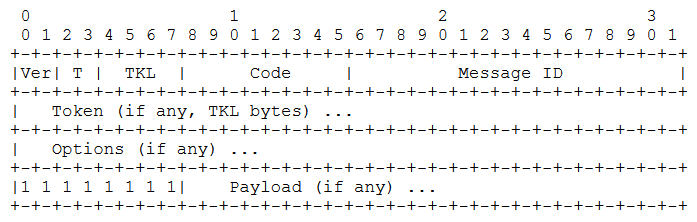
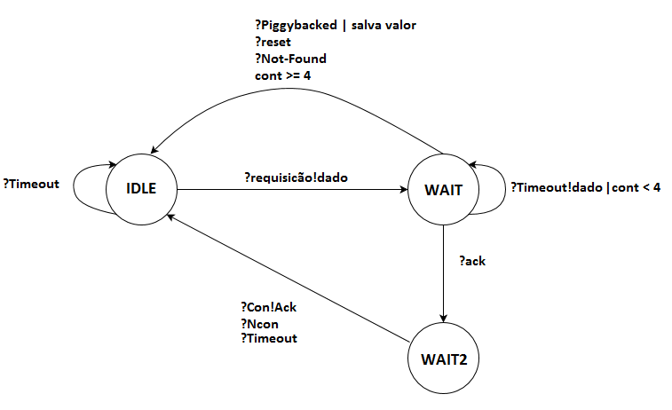
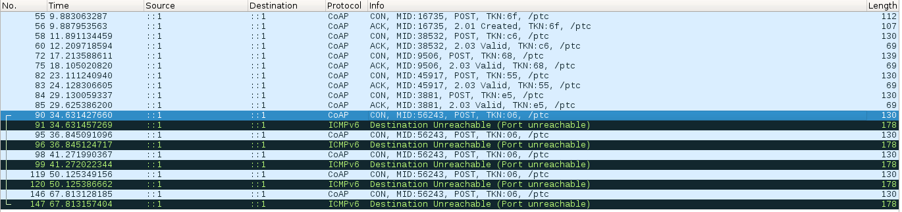
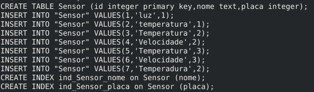
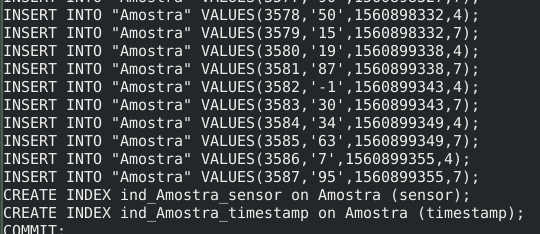

# Protocolo de comunicação seguindo a RFC 7252 (CoAP)

## Sumário
+ [Descrição](#descricao)
+ [Especificação](#especificacao)
+ [Máquina de estado](#modelo)
+ [Descrição da API](#api)
+ [Manual](#manual)


<div id='descricao'/>

## 📋 Descrição

>Projeto consiste no desenvolvimento de um protocolo de aplicação CoAP, tendo como
base a RFC 7252 em que foram seguidas suas especificações para implementar um protótipo de
sistema de aquisição de dados no qual as mensagens são codificadas com Protocol Buffers e
transmitidas por links sem-fio ponto-a-aponto.

<div id='especificacao'/>

## 📋 Especificação

>O formato de mensagens utilizado por esse protocolo segue a RFC 7252. Descrição de cada campo assim como o seu valor se encontram logo abaixo.

<p align="center">
  
</p>


+ **Ver:** 2-bit unsigned interger, sendo esses bits 01, representando a versão.
+ **T:** 2-bit unsigned interger, nesse caso as mensagens enviadas são sempre confirmáveis,
então foi assumido o valor 00. Para respostas assume-se o valor 10(Confirmação)
+ **Token Length(TKL):** 4-bit unsigned integer, o tamanho do Token utilizado foi de apenas 1
byte(0001).
+ **Code:** A RFC possui quatro métodos possíveis além do Ack para serem utilizados, mas
nesse protocolo foi usado somente os abaixo Get e Post. O Ack é usado apenas para
confirmação de uma resposta recebida pelo protocolo.

<p align="center">
  
</p>

+ **Message ID:** 16-bit unsigned integer, no protocolo está sendo representado pelas variáveis
MID1 e MID2 que são gerados randomicamente a cada envio de mensagem com valor entre
0 e 255.
+ **Token:** Como TKL é 1 byte, o valor do Token utilizado é um inteiro randômico entre 0 a 255
alterando a cada envio assim como Message ID.
+ **Options:** Foram assumidos dois tipos de options: Uri-Path e Content-Format. A Uri-Path
é representada pelo valor 11(4-bit MSB) mais o tamanho da URI(4-bit LSB). Já o ContentFormat é representado pelo valor 12(4-bit MSB) mais o tamanho da opção(4-bit LSB) que
nesse caso é 1 byte, pois o valor correspondente ao tipo de mídia transportado é representando por 1 byte de valor 42.
+ **Payload:** O Payload que esse protocolo suporta, são mensagens codificadas por meio do
Protocol Buffers que resultam em um tipo de mída chamado octet-stream, que é representado pelo valor 42, como mencionado na Options.

<div id='modelo'/>

## Modelo de Software - Máquina de estado

<p align="center">
  
</p>

<div id='api'/>

## Descrição da API


+ **Ack_Response(self):**
** Função interna do protocolo, não deve ser chamada por uma aplicação, **
Monta uma mensagem de resposta apenas para ser usado como comparação para quando receber algum datagrama.

+ **Do_Get(self, Uri, Payload):**
Recebe uma Uri e um payload. Monta uma mensagem com Code GET e envia para o handle_fsm
fazer a tratativa. Logo em seguida faz o despache para o poller monitorar os eventos futuros.

+ **Do_Post(self, Uri, Payload)**
Recebe uma Uri e um payload. Monta uma mensagem com Code POST e envia para o handle_fsm fazer a tratativa. Logo em seguida faz o despache para o poller monitorar os eventos
futuros.

+ **Push_Ack(self, MID1, MID2, TOKEN)**
** Função interna do protocolo, não deve ser chamada por uma aplicação, **
Recebe como parâmetro os dois bytes contidos na Message ID e o Token de 1 byte. Monta uma
mensagem de confirmação com payload vazio

+ **Reload_Timeout_Ack(self, value)**
** Função interna do protocolo, não deve ser chamada por uma aplicação, **
O tempo da retransmissão é calculado como (2+4+8+16)*ACK_TIMEOUT_FACTOR, onde a primeira transmissão é 2*ACK_TIMEOUT_FACTOR, segunda 4*ACK_TIMEOUT_FACTOR e assim
3por diante.Resultando em um total de 4 tentativas de retransmissão, não ultrapassando o tempo
máximo de 45 segundos estipulado pela RFC.

+ **Return_Base_Timeout(self)**
Retorna o valor do timeout para o valor que foi definido como padrão. No caso foi
2*ACK_TIMEOUT_FACTOR

+ **Set_Periodo(self, periodo)**
Recebe uma valor em milisegundos para ser utilizado como tempo de envio de dados. No caso,
irá ficar enviando dados coletados a cada periodo recebido.

+ **__init__(self, ip, Uri)**
Construtor que recebe como parâmetro um IP(IVP6) mais a Uri que será utilizada como destino ao enviar mensagens para o servidor. Cria um socket e vincula-o com o IP fornecido.

+ **handle(self)**
Fica monitorando o socket criado para caso receber alguma mensagem, enviar para máquina de
estado tratar. Recebe mensagem de até 2048 bytes.

+ **handle_fsm(self, data)**
Máquina de estado responsável por enviar as mensagens assim que a aplicação faz uma requisição, assim como trata um datagrama recebido do servidor. Nesse protocolo desenvoldido, o
estado idle é o responsável por enviar o datagrama contendo as configurações da API assim que
é iniciada. O Estado wait fica aguardando uma resposta do servidor, caso envie uma mensagem
piggybacked salva o valor recebido para aplicação coletar o payload. Wait2 seria caso o servidor
enviasse apenas um Ack estando no Wait, ele fica esperando o recebimento da resposta.

+ **handle_timeout(self)**
Responsável por fazer a retransmissão caso
alguma mensagem COAP seja enviada e não receba nenhuma resposta do servidor. Tempo
utilizado para isso esta descrito em Reload_Timeout_ack()


### Atributos estáticos definidos

| Atributo | Valor  |
|---|---|
|ACK_TIMEOUT | 2 |
|ACK_TIMEOUT_FACTOR | random.uniform(1,1.5)|
|Delta1_Path  |176 |
|Delta2_Path | 0 |
|MAX_RETRANSMIT | 4 |
|Teste_Get | None |
|end | 255 |
|idle | 0 |
|wait | 1 |
|wait2 | 2 |


## Métodos herdados da classe poller.Callback:

| Método | Descrição
| --- | --- |
|disable(self) | Desativa o monitoramento do descritor neste callback|
|disable_timeout(self) |Desativa o timeout|
|enable(self) |Reativa o monitoramento do descritor neste callback|
|enable_timeout(self) |Reativa o timeout|
|reload_timeout(self) |Recarrega o valor de timeout|
| update(self, dt)| Atualiza o tempo restante de timeout|

## Descritores de dados herdados de poller.Callback:

| Descritor | Descrição
| --- | ----|
| isEnabled |true se monitoramento do descritor estiver ativado neste callback
| isTimer | true se este callback for um timer


<div id='manual'/>

## 🔧 Manual da aplicação


Para demonstrar o funcionamento do sistema de aquisição de dados deve-se executar o
arquivo CoAP_APP.py com python3. Por padrão ele está setado para enviar dados de dois sensores. Os valores da medição são calculados pela própria aplicação, não sendo necessário passar
como parâmetro. Os campos possíveis de serem alterados são: Nome da placa, lista de sensores(máximo dois) e a URI de destino, que nesse caso é /ptc. Um exemplo de como criar um objeto
CoapAPP é

```
Payload_App = CoapAPP("Renan",["Velocidade","Temperadura"],"/ptc")
```
Com o objeto criado é necessário chamar o método Protobuffer_Payload() que fará a coodificação da mensagem utilizando o Protocol Buffers e envia o payload para o Coap_Client.py
através do método Do_Post() disponível no mesmo. Logo em seguida, faz o despache utilizandoo poller

### Tráfego gerado na rede  

Imagem abaixo mostra o monitoramento feito na transmissão da aplicação-servidor. Inicialmente a aplicação envia um Post com Config, contendo o nome da placa e os nomes dos sensores a serem monitorados. O servidor responde com created com payload contendo o valor do período que
a aplicação deve ficar enviando os dados. Como pode se observar, o tempo foi de 5 segundos. Por fim, mostra a retransmissão quando o servidor está indisponível

<p align="center">
  
</p>

Alguns sensores que foram enviados/cadastrados no servidor. Essas informações estão contidas no banco de dados do servidor.

<p align="center">
  
</p>


Alguns valores de amostras coletadas pela aplicação e enviado ao servidor




